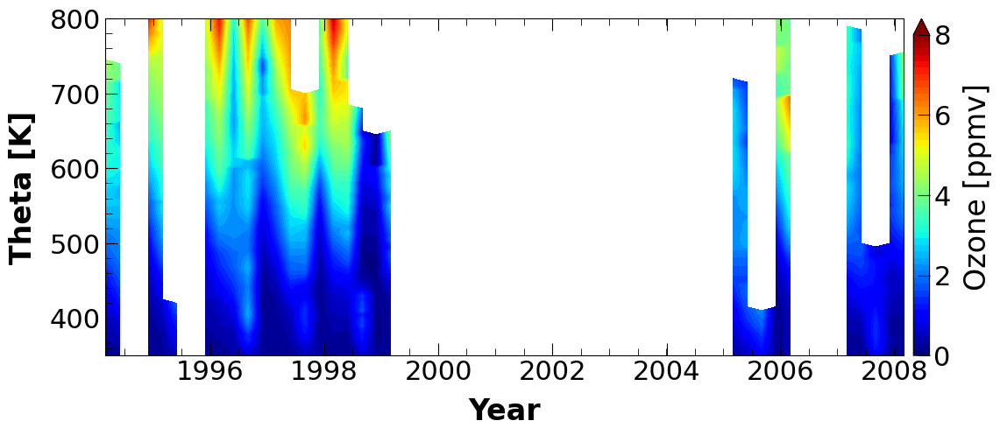
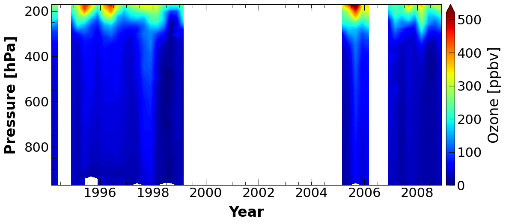
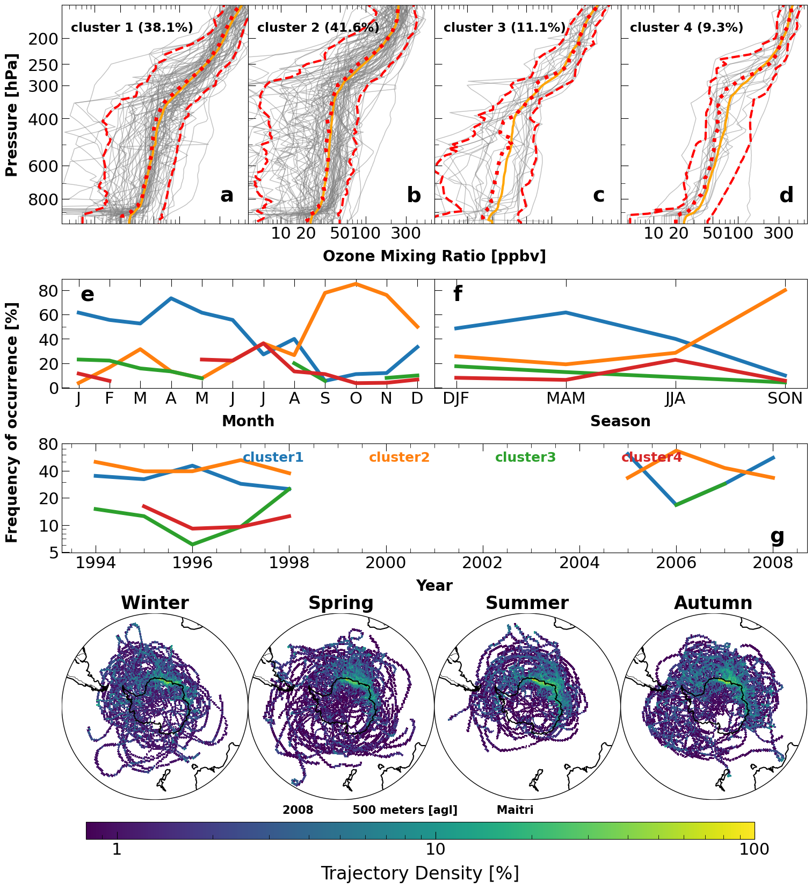
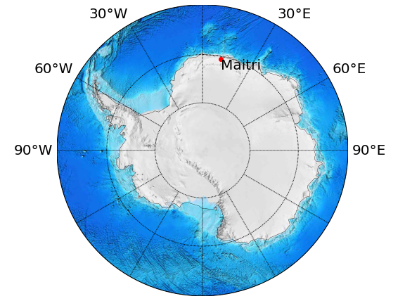

\newpage
\linenumbers

## Abstract

## Introduction

## Materials and Methods

## Results and Discussion

## Conclusions

### Online content

Any method, additional references, statements of data availability and associated accession codes are available in attached supplementary document.

### Acknowledgements

### Competing interests

The authors declare no conflict of interest.

### References
